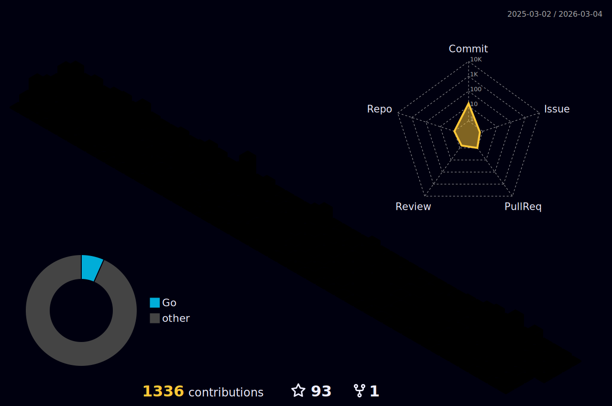

  

  <h3>🚀 Languages & Frameworks</h3>
  
  
  
  
  
  
  
  
  
  

  <h3>☁️ Cloud, OS & Security</h3>
  
  
  
  
  
  
  
  
  
  
  

  <h3>🛠️ Backend, DevOps & Database</h3>
  
  
  
  
  
  
  
  

  <h3>🤖 AI & APIs</h3>
  
  
  
  
  
  

  

    
  

  

